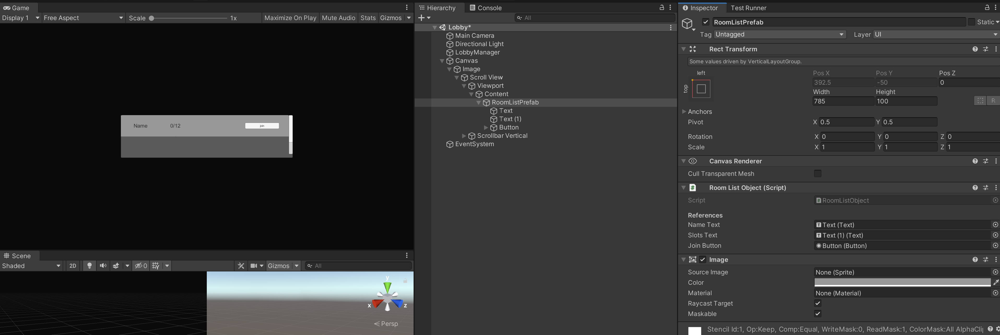

# Client Login System Part 2 and Lobby
After creating responses to the LoginRequest on the server we can let the client handle them.
To do that we first have to subscribe to server messages in the LoginManager script.
Add the following in the Start() function:
```csharp
ConnectionManager.Instance.Client.MessageReceived += OnMessage;
```
and the following in the OnDestroy function:
```csharp
ConnectionManager.Instance.Client.MessageReceived -= OnMessage;
```
(We always have to unsubscribe from events)

Also add the OnMessage function and functions to handle the responses:
```csharp
    private void OnMessage(object sender, MessageReceivedEventArgs e)
    {
        using (Message message = e.GetMessage())
        {
            switch ((Tags) message.Tag)
            {
                case Tags.LoginRequestDenied:
                    OnLoginDecline();
                    break;
                case Tags.LoginRequestAccepted:
                    OnLoginAccept(message.Deserialize<LoginInfoData>());
                    break;
            }
        }
    }

    private void OnLoginDecline()
    {
        loginWindow.SetActive(true);
    }

    private void OnLoginAccept(LoginInfoData data)
    {
    }
```
The OnMessage function works like the one we did on the server.

OnLoginDecline will just show the login window again. (You could a line of text saying login failed or something like that)

OnLoginAccept will store the data and load a LobbyScene. To do that we first have to create fields in the ConnectionManager to store data. (We will store all data that has to be preserved on scene changes in the ConnectionManager).

So Add to the ConnectionManager:
```csharp
    public ushort PlayerId { get; set; }

    public LobbyInfoData LobbyInfoData { get; set; }
```

and then modify the OnLoginAccept() function in the LoginManager to:
```csharp
    public void OnLoginAccept(LoginInfoData data)
    {
        ConnectionManager.Instance.PlayerId = data.Id;
        ConnectionManager.Instance.LobbyInfoData = data.Data;
        SceneManager.LoadScene("Lobby");
    }
```

Now let's create the client side lobby list.

- Create a new Scene "Lobby" in the Scenes folder and open it.
- Create a LobbyManager GameObject.
- Create a "LobbyManager" script in the Scripts folder and add it to the LobbyManager GameObject.

We want to display a list of all rooms in graphical matter, we will use UI elements for that:
- Create a Canvas > set it to "Scale with Screen Size" and set the Reference Resolution to 1920x1080
- Create a Scroll View as a child of the Canvas.
- Add a Vertical Layout Group to the Content object of the Scroll view

Now we need to create RoomObjects. First create a RoomObject script in the Scripts folder and open it and fill it with the following code:
```csharp
using UnityEngine;
using UnityEngine.UI;

public class RoomListObject : MonoBehaviour
{
    [Header("References")]
    [SerializeField]
    private Text nameText;
    [SerializeField]
    private Text slotsText;
    [SerializeField]
    private Button joinButton;
}
```
For now this is just a container to store references to components.
We will also have to create a prefab for the script:
- Create a UI Image as a child of the Content of Scroll View and name it RoomListPrefab.
- Add 2 texts and a button to it, 1 text will be the name the other the slots and the button will be used to join the room.
- Add the RoomListObject script to it and refrecne the texts and the button.

It should now look like this:\


Now drag the RoomListPrefab into the prefabs folder and then delete it from the scene.

Open the LobbyManager script and set it to:
```csharp
using DarkRift;
using DarkRift.Client;
using UnityEngine;
using UnityEngine.SceneManagement;

public class LobbyManager : MonoBehaviour
{
    [Header("References")]
    [SerializeField]
    private Transform roomListContainerTransform;

    [Header("Prefabs")]
    [SerializeField]
    private GameObject roomListPrefab;

    void Start()
    {
        ConnectionManager.Instance.Client.MessageReceived += OnMessage;
        RefreshRooms(ConnectionManager.Instance.LobbyInfoData);
    }

    void OnDestroy()
    {
        ConnectionManager.Instance.Client.MessageReceived -= OnMessage;
    }

    private void OnMessage(object sender, MessageReceivedEventArgs e)
    {
        using (Message message = e.GetMessage())
        {
            switch ((Tags)message.Tag)
            {
            }
        }
    }

    public void SendJoinRoomRequest(string roomName)
    {
    }

    public void RefreshRooms(LobbyInfoData data)
    {
        RoomListObject[] roomObjects = roomListContainerTransform.GetComponentsInChildren<RoomListObject>();

        if (roomObjects.Length > data.Rooms.Length)
        {
            for (int i = data.Rooms.Length; i < roomObjects.Length; i++)
            {
                Destroy(roomObjects[i].gameObject);
            }
        }

        for (int i = 0; i < data.Rooms.Length; i++)
        {
            RoomData d = data.Rooms[i];
            if (i < roomObjects.Length)
            {
                roomObjects[i].Set(this, d);
            }
            else
            {
                GameObject go = Instantiate(roomListPrefab, roomListContainerTransform);
                go.GetComponent<RoomListObject>().Set(this, d);
            }
        }
    }
}
```

This might look overwhelming at first glance but its very simple.
The script has a reference to a RoomListContainerTransform which is the transform of the Content and a reference to the RoomListPrefab. (you should go drag them into their respective fields).
It also subscribes like the LoginManager to the server to recieve messages.

The last thing it does is the RefreshRooms() function. It updates or instantiates new RoomListObjects. The Set function is something which is not yet present in the RoomListObject script. Let's add it. This provides all necessary information to the graphics side to display a lobby and sets up the button so that it calls the SendJoinRoomRequest function which we created earlier in the LobbyManager.
```csharp
    public void Set(LobbyManager lobbyManager, RoomData data)
    {
        nameText.text = data.Name;
        slotsText.text = data.Slots + "/" + data.MaxSlots;
        joinButton.onClick.RemoveAllListeners();
        joinButton.onClick.AddListener(delegate { lobbyManager.SendJoinRoomRequest(data.Name); });
    }
```

At this point you can try to run the project. Run the server first and then the client and check it you can log in and if it displays 2 rooms "Main" and "Main 2" in the lobby.

If everyting works fine you can continue. If not, try to look if any errors occurred somewhere. If you are stuck you can always contact me on Discord (@Allmaron#6641), Email(luke@stampfli.one) or ask in the [Offical Darkrift Discord](https://discordapp.com/invite/cz2FQ6k)

The next step is to allow the player to join a Room. We will need to create new request messages for that.
First add the following new Tags in the NetworkingData.Tags enum:
```csharp
    LobbyJoinRoomRequest = 100,
    LobbyJoinRoomDenied = 101,
    LobbyJoinRoomAccepted = 102,
```

We also need a new data object for the request so also add:
```csharp
public struct JoinRoomRequest : IDarkRiftSerializable
{
    public string RoomName;

    public JoinRoomRequest(string name)
    {
        RoomName = name;
    }

    public void Deserialize(DeserializeEvent e)
    {
        RoomName = e.Reader.ReadString();
    }

    public void Serialize(SerializeEvent e)
    {
        e.Writer.Write(RoomName);
    }
}
```

And then open the LobbyManager and add/replace these functions:
```csharp
    public void SendJoinRoomRequest(string roomName)
    {
        using (Message message = Message.Create((ushort)Tags.LobbyJoinRoomRequest, new JoinRoomRequest(roomName)))
        {
            ConnectionManager.Instance.Client.SendMessage(message, SendMode.Reliable);
        }
    }

    public void OnRoomJoinDenied(LobbyInfoData data)
    {
        RefreshRooms(data);
    }

    public void OnRoomJoinAcepted()
    {
        SceneManager.LoadScene("Game");
    }
```
And change the OnMessage function to:
```csharp
    private void OnMessage(object sender, MessageReceivedEventArgs e)
    {
        using (Message message = e.GetMessage())
        {
            switch ((Tags)message.Tag)
            {
                case Tags.LobbyJoinRoomDenied:
                    OnRoomJoinDenied(message.Deserialize<LobbyInfoData>());
                    break;
                case Tags.LobbyJoinRoomAccepted:
                    OnRoomJoinAcepted();
                    break;
            }
        }
    }
```

Ok so what does this do?
We have a function SendJoinRoomRequest to ask the server to join a room with a given Name.
The server can respond with an Accepted or a Denied resposne. The Denied request will contain new RoomDatas so that the rooms and available slots get refreshed and the accepted will just load the "Game" scene because it means we connected successfully.

Your scripts should now look like this:
- [LoginManager](https://github.com/LukeStampfli/EmbeddedFPSExample/tree/master/gists/login3-LoginManager.cs)
- [ConnectionManager](https://github.com/LukeStampfli/EmbeddedFPSExample/tree/master/gists/login3-ConnectionManager.cs)
- [RoomListObject](https://github.com/LukeStampfli/EmbeddedFPSExample/tree/master/gists/login3-RoomListObject.cs)
- [LobbyManager](https://github.com/LukeStampfli/EmbeddedFPSExample/tree/master/gists/login3-LobbyManager.cs)
- [NetworkingData](https://github.com/LukeStampfli/EmbeddedFPSExample/tree/master/gists/login3-NetworkingData.cs)

The lobby and login system is now fully completed on the client. Now, we will swap now to the server to finish the system there too.